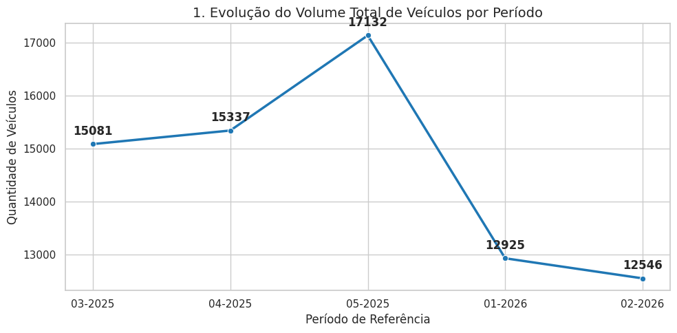
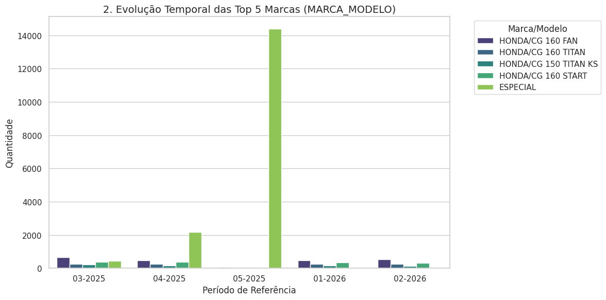
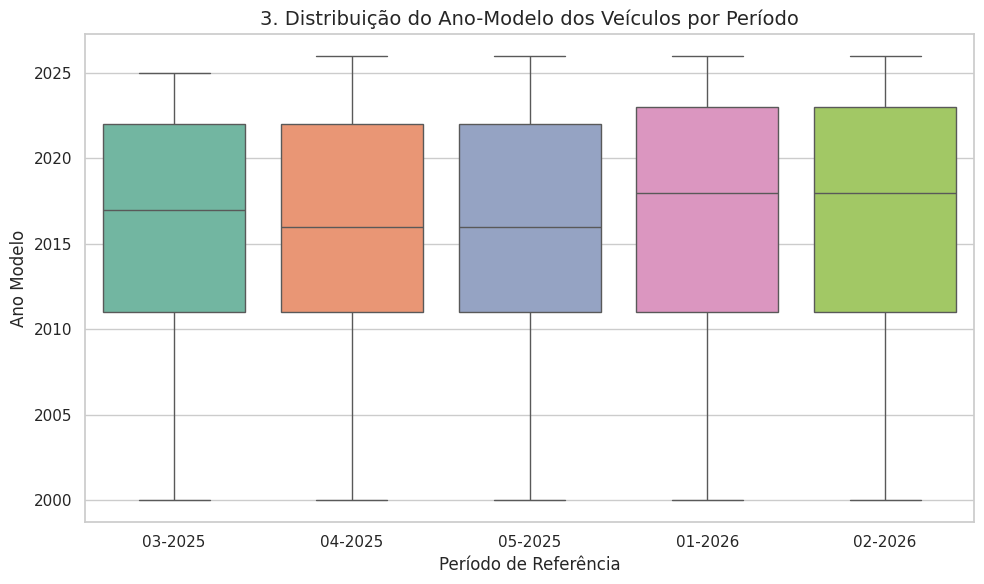
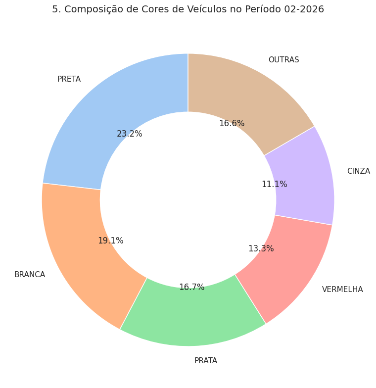

# log1noturno
Planilhas eletrônicas de dados abertos
# 🚗 Análise Comparativa do Mercado de Veículos (2025 - 2026)

Este repositório apresenta um projeto de análise de dados exploratória e comparativa baseado em um dataset integrado contendo **73.021 registros de veículos**. Os dados foram consolidados a partir de 5 planilhas de inventário que cobrem o período de **março de 2025 a fevereiro de 2026**.

O principal objetivo é mapear o comportamento histórico do mercado de veículos, identificar tendências nas marcas mais vendidas/cadastradas, analisar a flutuação do ano-modelo da frota e compreender suas características físicas dominantes (cores e tipos de veículo).

---

## 📈 Visualizações & Insights Principais

### 1. Evolução do Volume de Veículos por Período
Este gráfico mapeia a quantidade total de ocorrências de veículos registradas no estoque ao longo de cada mês analisado.

* **Insight**: Permite monitorar a estabilidade, crescimento e possíveis momentos de retração ou expansão do catálogo de veículos mês a mês.

---

### 2. Evolução Temporal das Top 5 Marcas
Demonstra o desempenho e presença histórica das cinco principais marcas/modelos mais comuns encontradas no dataset integrado.

* **Insight**: Avalia o market-share interno de marcas consagradas (como a liderança da Honda) e sua estabilidade ao longo do tempo.

---

### 3. Distribuição do Ano-Modelo dos Veículos
Através de Boxplots mensais, visualizamos o perfil de maturidade/idade da frota ativa de veículos cadastrados.

* **Insight**: Permite enxergar com rapidez a idade mediana dos veículos em estoque e identificar o comportamento de entrada de lançamentos.

---

### 4. Distribuição dos Principais Tipos de Veículo
Mapeia a flutuação na participação das diferentes categorias de veículos (como Carros, Motos, Utilitários e Bicicletas) ao longo do tempo.

* **Insight**: Útil para entender as mudanças de perfil de locomoção e diversificação dentro do inventário global.

---

### 5. Composição de Cores de Veículos (Último Período)
Um gráfico de rosca (Donut) focado no último mês disponível (`02-2026`) que detalha a relevância de cada cor na liquidez do catálogo.

* **Insight**: Confirma a dominância histórica de cores comerciais (Preta, Branca, Prata) frente a opções menos tradicionais.

---
# INFORMATICA-APLICADA-A-LOGISTICA-FATEC
TRABALHOS DE INFORMÁTICA E LOGISTICA 
## APRESENTAÇÃO PESSOAL E EQUIPE

## ANNT MULTIMODAIS

